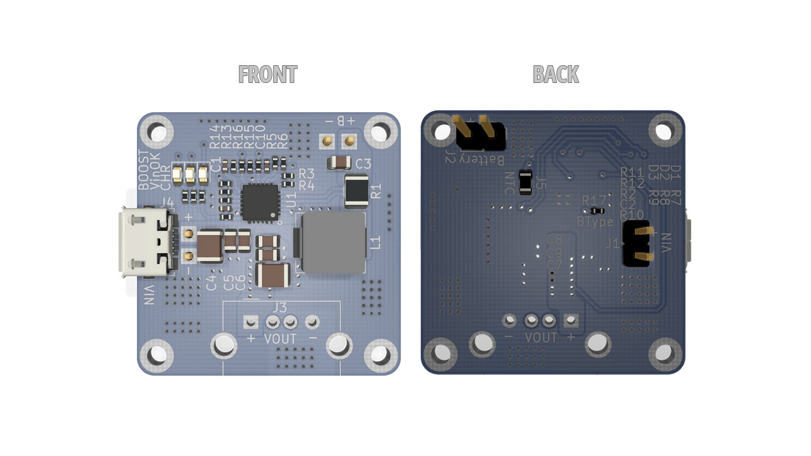
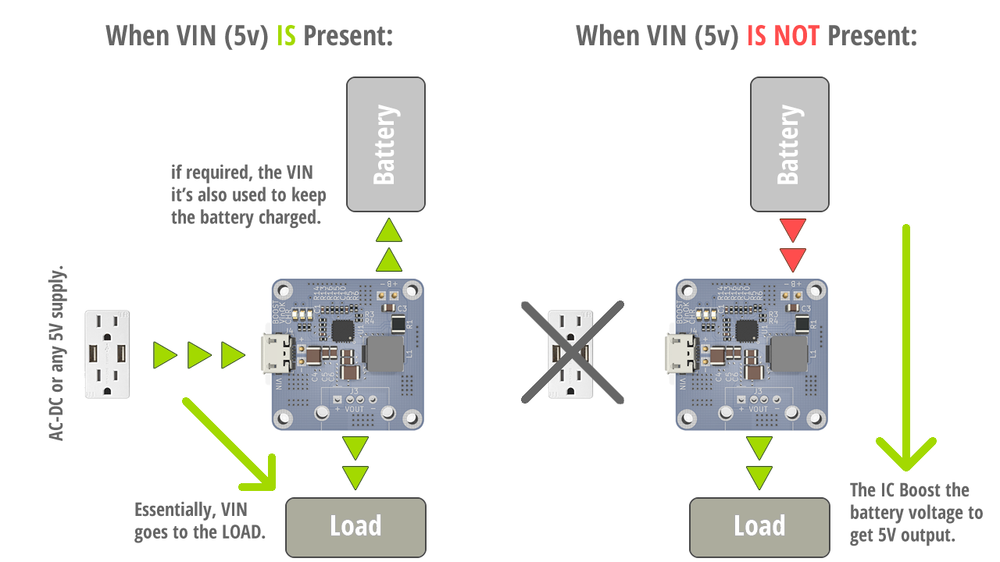

# 5V_UPS

A real 5V Uninterruptible Power Supply (UPS) based on the [MP2637](https://www.monolithicpower.com/en/mp2637.html) IC, supporting 4.2V and 4.35V LiION/LiPO batteries. The design it's practically the design layout recomended by the manufacturer just with a few minor differences.

The board it's 30x30mm and it's capable of 2.5A battery charge and 2.4A boost output.

## Working as a proper UPS:

